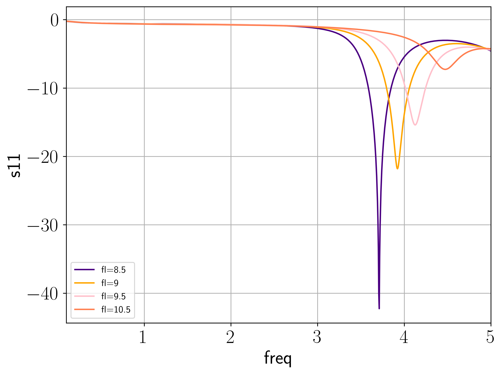

# Cst-Studio-Plotter 


[](https://jupyter.org/try)


An experimental script to automate high quality graph plotting for resutls exported from CST Studio.

## Installing

Clone this repository using

```bash
git clone https://github.com/pathak373/cst-studio-plotter
cd cst-studio-plotter
pip install -r requirements.txt
```

## Usage

The results from the cst project must be exported in ASCII format, which must be stored in the `results` directory. `plot` fucntion can be called to plot the required graphs, which will be saved in the `plots` directory.

The input parameters of the plot function are

```py
def plot(
    filename, 
    y_label: str, 
    x_label: str, 
    convert_abs: bool = False, 
    clip_vswr_threshold: int = 0, 
    required_frequency: float = 0.0):
```

`filename`: plot data filename

`y_label`: y-axis label

`x_label`: x-axis label

`convert_abs`: convert logarithmic scale to percentage

`clip_vswr_threshold`: clip max vswr value to the threshold

`required_frequency`: the operational frequency

## Example Plots




